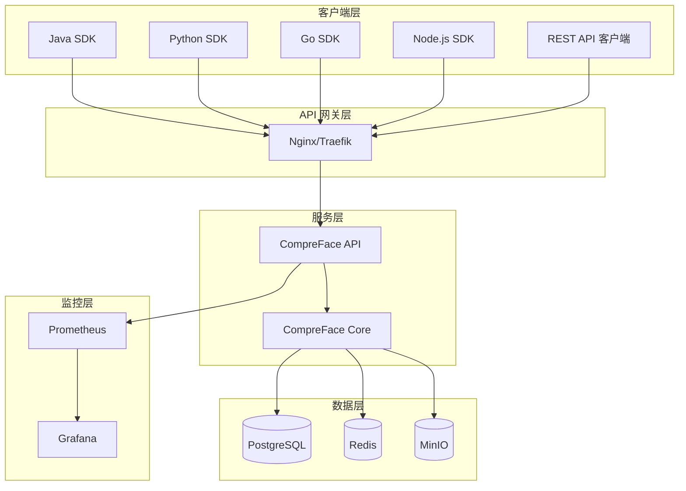
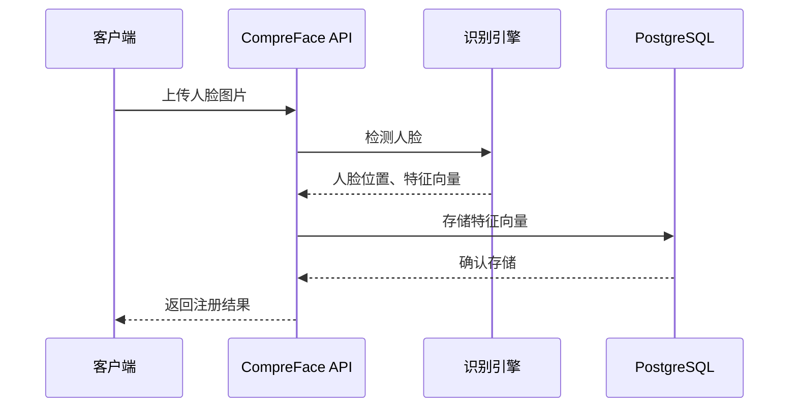
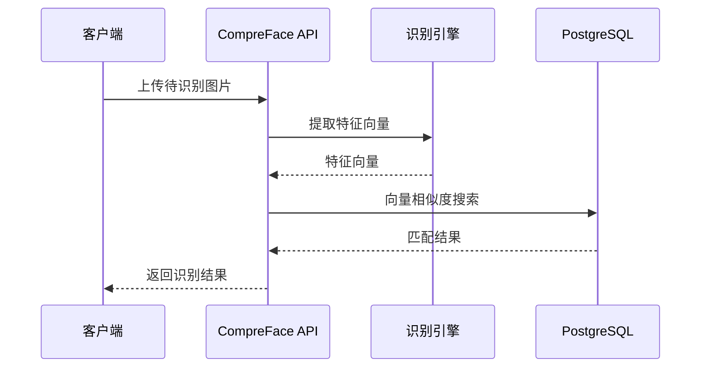
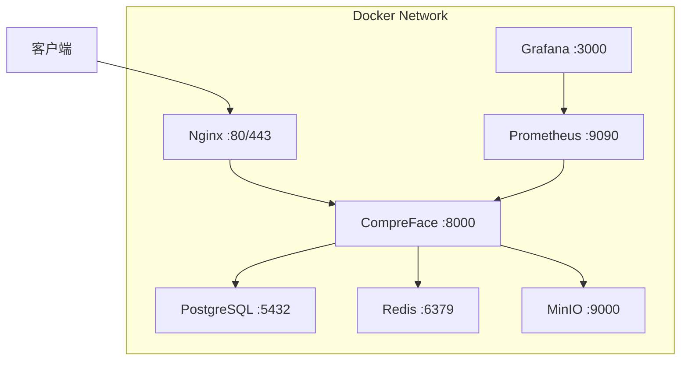
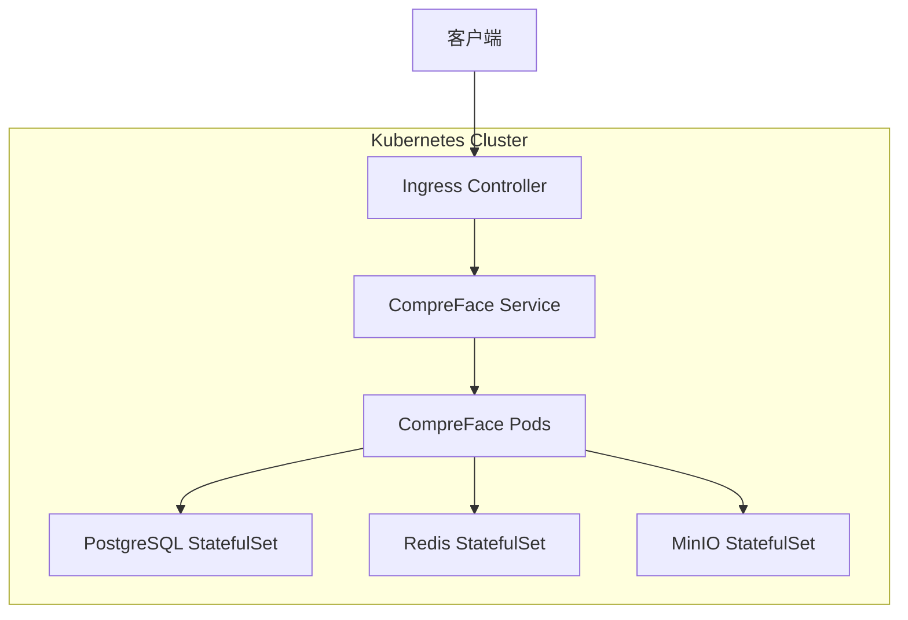

# FaceSDK 架构设计文档

## 系统架构

## 组件说明

### 1. 客户端层

- **Java SDK**: 基于 OkHttp，支持 JDK 11+，兼容 Spring Boot
- **Python SDK**: 基于 requests/aiohttp，支持 Python 3.8+，同步/异步双支持
- **Go SDK**: 基于标准库 net/http，支持 Go 1.18+
- **Node.js SDK**: 基于 axios，支持 Node.js 14+

### 2. API 网关层

- **Nginx**: 反向代理、负载均衡、SSL 终止
- **Traefik**: 云原生反向代理，支持自动服务发现

### 3. 服务层

- **CompreFace API**: REST API 接口层
- **CompreFace Core**: 人脸识别核心引擎
  - 人脸检测：MTCNN/RetinaFace
  - 特征提取：FaceNet (128维) / ArcFace (512维)

### 4. 数据层

- **PostgreSQL**: 人脸特征和元数据存储
- **Redis**: 缓存和会话存储
- **MinIO**: 原始图片对象存储（可选）

### 5. 监控层

- **Prometheus**: 指标采集
- **Grafana**: 可视化仪表盘

## 数据流

### 人脸注册流程

### 人脸识别流程

## 部署架构

### Docker Compose 部署

### Kubernetes 部署

## 安全设计

### 认证与授权

- API Key 认证：每个请求必须携带 `x-api-key` 头部
- HTTPS 传输：生产环境强制使用 TLS 1.2+
- 请求限流：基于 IP 和 API Key 的限流保护

### 数据安全

- 人脸特征向量加密存储
- 原始图片可选加密存储
- 数据库连接使用 SSL
- 定期备份策略

## 性能优化

### 缓存策略

- Redis 缓存热点人脸特征
- 本地缓存常用配置
- CDN 加速静态资源

### 水平扩展

- 无状态 API 服务，支持多实例部署
- 数据库读写分离
- 负载均衡分发请求

## 高可用设计

### 故障转移

- 多实例部署，自动故障转移
- 数据库主从复制
- Redis Sentinel 高可用

### 数据备份

- 自动定时备份
- 跨区域备份
- 快速恢复机制
